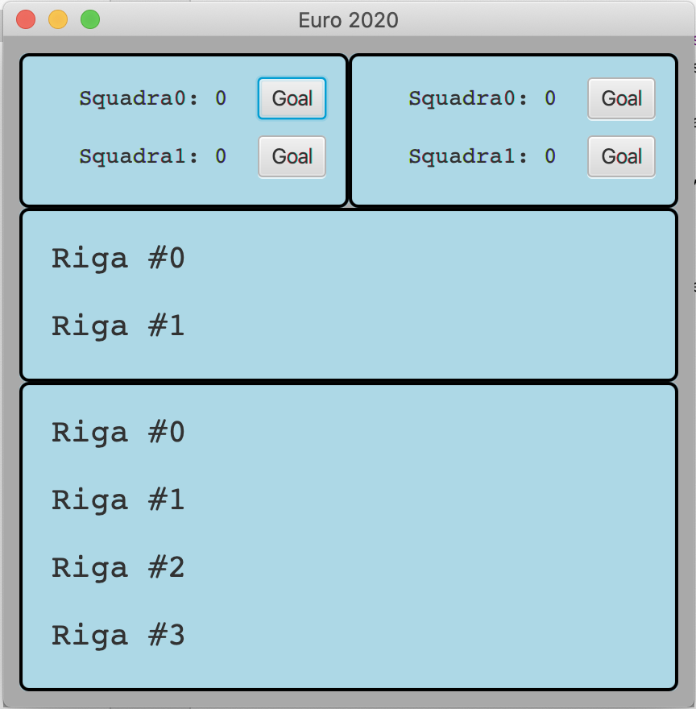
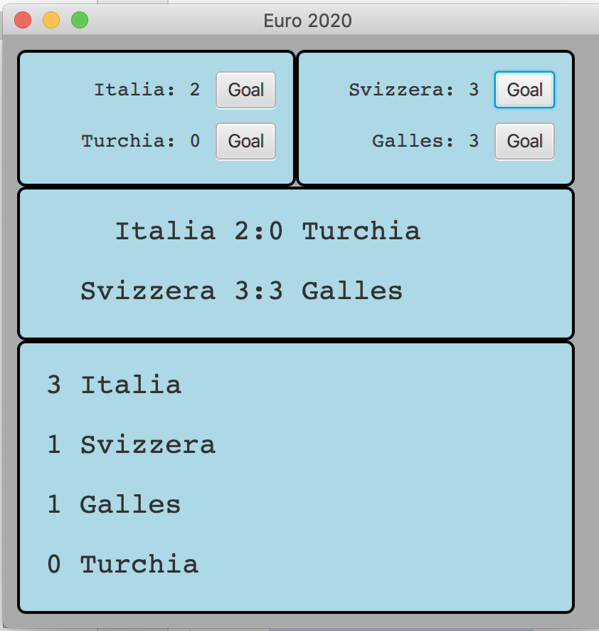

# EURO 2020/21

Obiettivo dell'esercizio è progettare e realizzare un insieme di classi atte a
produrre un semplice programma Java che si occupi di gestire i risultati di
alcune partite degli Europei di calcio.

Vengono fornite due *Viste* del sistema:

- `MatchView`: la vista di una partita (che permette di segnalare quando viene
  fatto un goal)
- `GeneralDisplayView`: un display generale che presenta una serie di righe di
  testo (numero fissato alla costruzione) usabile per presentare sia risultati
  che la classifica

Viene fornita anche una classe `Main` che permette d'istanziare la parte statica
delle viste, e una classe `MatchPresenter` già predisposta a ascoltare gli
eventi dei bottoni.

**TUTTE LE CLASSI DATE POSSONO ESSERE DA VOI MODIFICATE (CANCELLATE, COMPLETATE)
PER ADERIRE A VOSTRE IDEE DI PROGETTAZIONE**

Lanciando il programma (tramite il task `run` di gradle) si ottiene una
interfaccia come quella nella figura sottostante.

Allo stato attuale, la parte già implementata fa sì che:

- Quando si preme uno dei bottoni `Goal` viene chiamato il metodo del
  *presenter* `goal(int)` che stamperà una scritta sullo *stderr*.

## TRACCIA

Completare, in modo da realizzare un'organizzazione del sistema di tipo
*Model-View-Presenter*, le classi già presenti (`Main`, `MatchPresenter`) e
aggiungere le classi necessarie (`EuroModel`, `ResultsPresenter`
`RankingPresenter`) in modo che:

- alla pressione dei bottoni goal si aggiornino sia le varie viste che
  presentano i risultati, che la vista che calcola la classifica (Va bene
  considerare solo i punti, facoltativo considerare a parità di punti la
  differenza reti)

Ad esempio avendo creato un model con le due partite della prima giornata del
girone dell'Italia, nel momento in cui si fosse premuto per due volte il bottone
`Goal` dell'Italia e per tre volte i bottoni `Goal` della Svizzera e del Galles,
l'interfaccia dovrebbe essere simile a

## ALTRE RICHIESTE E DOMANDA

Vi abbiamo al momento fornito solo classi concrete, qualora lo riteneste utile
per un buon design potete introdurre astrazioni (interfacce o classi astratte),
corredando l'aggiunta con la spiegazione del perché i cambiamenti effettuati
migliorano il progetto. Nel caso, invece, non riteneste opportuno l'uso di
ulteriori interfacce e classi astratte, motivate questa scelta.

## CONSEGNA

Creare uno file `.zip` il contenuto della directory `src` e il file contenente
la risposta alla domanda.

